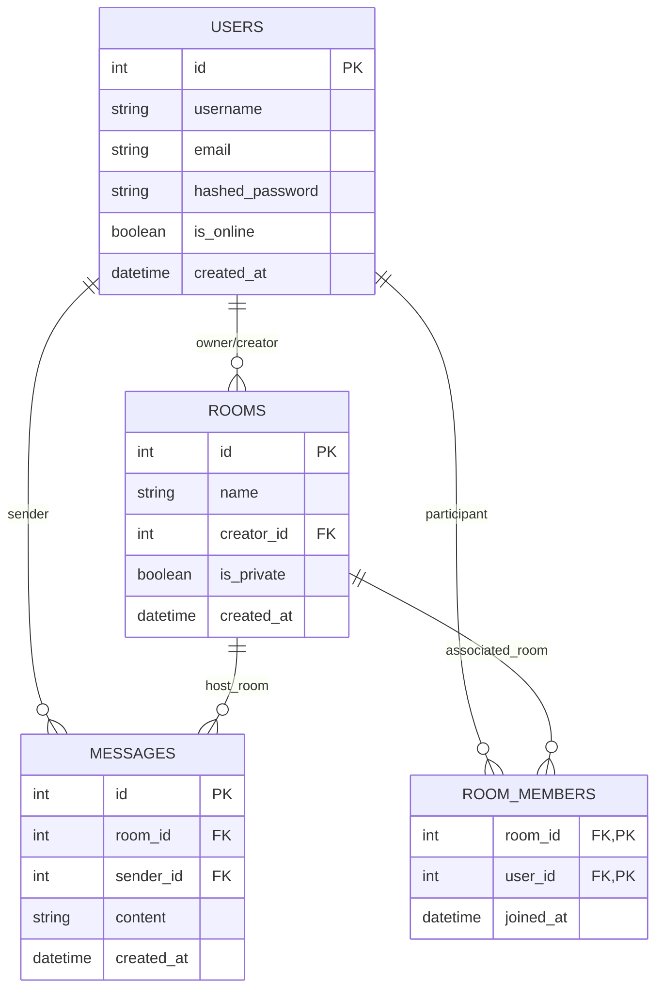

# Database Design - Video Chat App (SQLite)

## Entity Relationship Diagram (Mermaid)

---

## Entity Relationship Diagram (Conceptual)
- **User** (1) <-> (N) **Room** (Created By)
- **User** (N) <-> (N) **Room** (via **RoomMember**)
- **Room** (1) <-> (N) **Message**
- **User** (1) <-> (N) **Message**

---

## Tables

### 1. `users`
Stores user identity and authentication details.
| Column | Type | Constraints | Description |
| :--- | :--- | :--- | :--- |
| `id` | UUID/INT | Primary Key | Unique identifier |
| `username` | VARCHAR | Unique, Not Null | Public handle |
| `email` | VARCHAR | Unique, Not Null | User email |
| `hashed_password`| VARCHAR | Not Null | Argon2/BCrypt hash |
| `is_online` | BOOLEAN | Default False | Real-time status |
| `created_at` | DATETIME | Default Now | Account age |

### 2. `rooms`
Stores chat room metadata.
| Column | Type | Constraints | Description |
| :--- | :--- | :--- | :--- |
| `id` | UUID/INT | Primary Key | Unique identifier |
| `name` | VARCHAR | Not Null | Room name |
| `creator_id` | INT | FK -> `users.id` | Room owner |
| `is_private` | BOOLEAN | Default False | Accessibility |
| `created_at` | DATETIME | Default Now | - |

### 3. `room_members`
Junction table for Many-to-Many relationship between Users and Rooms.
| Column | Type | Constraints | Description |
| :--- | :--- | :--- | :--- |
| `room_id` | INT | FK -> `rooms.id` | - |
| `user_id` | INT | FK -> `users.id` | - |
| `joined_at` | DATETIME | Default Now | - |

### 4. `messages`
Stores persistent chat history.
| Column | Type | Constraints | Description |
| :--- | :--- | :--- | :--- |
| `id` | INT | Primary Key | Unique identifier |
| `room_id` | INT | FK -> `rooms.id` | Target room |
| `sender_id` | INT | FK -> `users.id` | Message author |
| `content` | TEXT | Not Null | Message body |
| `created_at` | DATETIME | Default Now | Timestamp |

---

## Normalization Notes
1. **1NF:** Each column contains atomic values; no repeating groups.
2. **2NF:** All non-key attributes are fully functional dependent on the primary key (facilitated by the `room_members` junction table).
3. **3NF:** No transitive dependencies.
